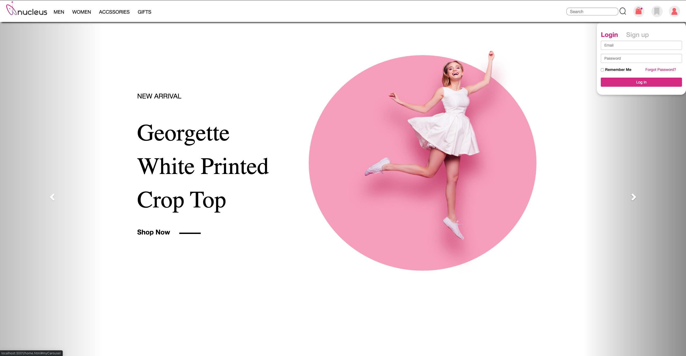
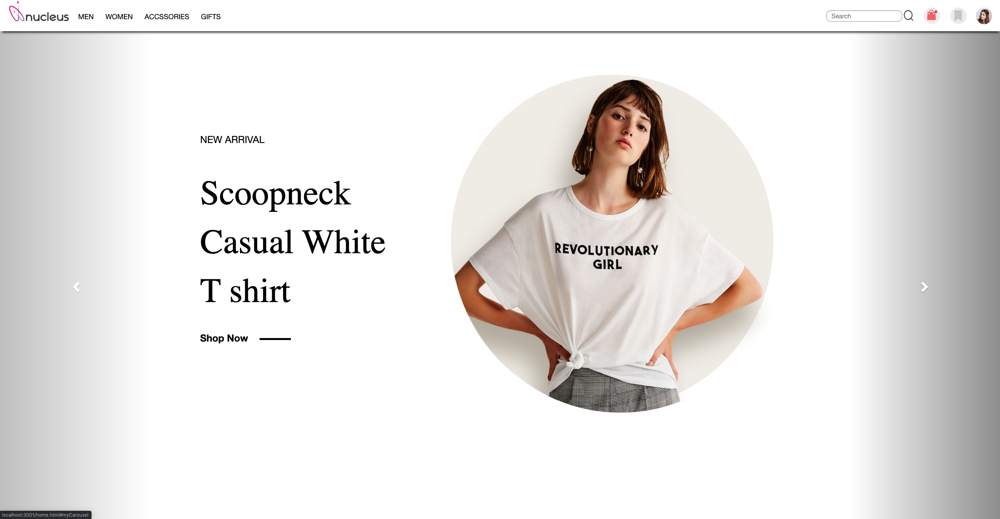
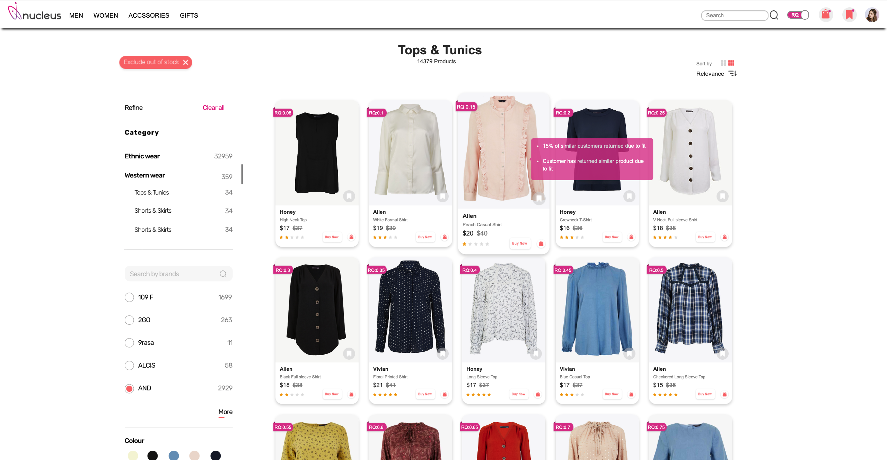
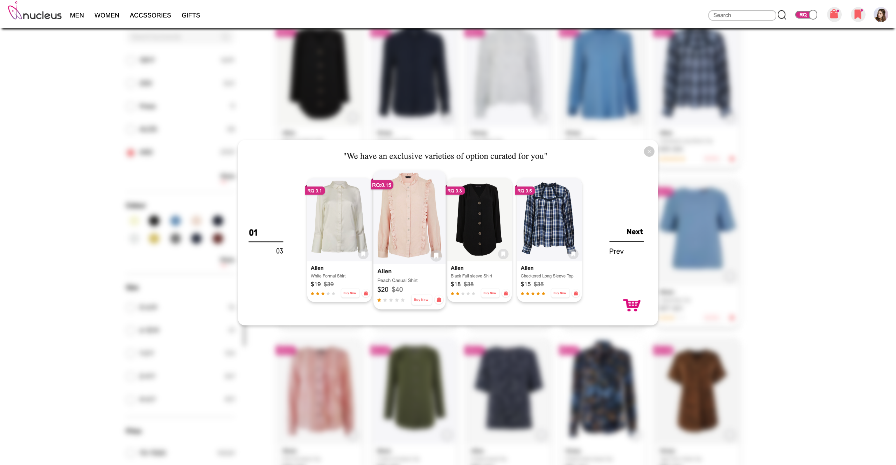
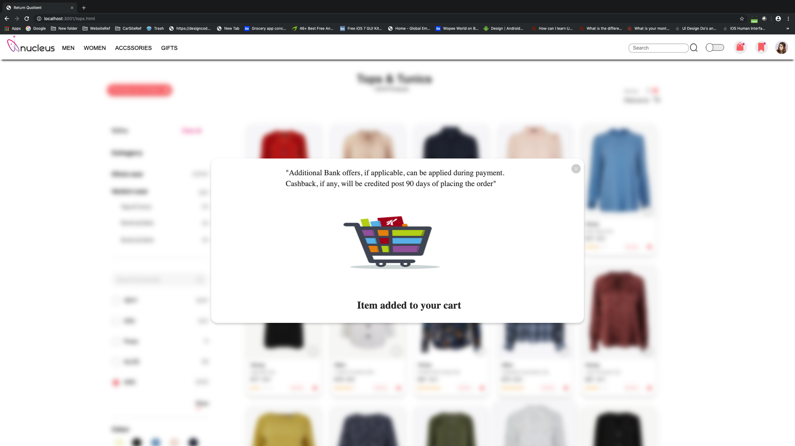

# simple_flipkart_demo_website_v2.0
This is totally small e-commerce website using MongoDB, NodeJS -Express, and HTML,CSS,Bootstrap. This is basic structure for the understanding structure.  Version 2.0

            

            

           

# For dataBase we used mongoDB and uploading the database by running "node data_loader.js" 
# Then the server file will run using "npm start or node index.js" 
Server will start running localhost:3001 
you can see the JSON data onb localhost:3001/products 
and now once server starts running you can open the HTML page by typing localhost:3001/home.html 

# Things to remember :
For installing mongo type "npm install mongo"
You should see the port number of the mongo by typing "mongo"
To see the database type:  mongo 
                          show dbs
                      
# Steps:
create a folder of any name
Go to terminal and open the path of that folder:

npm init

npm install

# For installing express Setup:

npm install express

# To Load the data on MongoDB

node data_loader.js

After that you can use this code.. and Start the server by typing: npm start or node test.js

open the brower and check the local host and you can see the uploaded data on this link: localhost:3001/products
